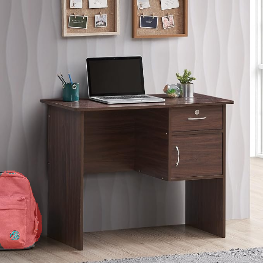

# Avataar Assignment

## Description of Files
1. generate_mask.py - Generates mask for a given image
2. shift_object.py - inpaints the objected to shifted and then moves the given object by x and y
3. utils.py - util funtions for all the functionality
4. task1_script.sh - a script to do task 1 of the assignment on all the given images
5. task2_script.sh - a script to do task 2 of the assignment on all the given images
6. requirement.txt - dependency for the assignment
7. Avataar.ipynb - Notebook with all the functionity[Ignore]

## Folder Structure
1. input_images - all the input images are present in this folder
2. output_images - all the generated images are present in this folder.
   - masked_image_{image_name}.png: generated image with generate_mask.py. These images have mask on the object as required in Task 1
   - shifted_image_{image_name}.png: Generated using shift_object.py. These object specified are shift by x and y coordinate as required for Task 2

## Usage
Install the dependency with **requirements.txt**

To generate mask on images:
<code>$python generate_mask.py --image "./input_images/bagpack.jpg" --object "bagpack" --output "./output_images/masked_image_bagpack.png" </code>

To shift object:

<code>$python shift_object.py --image "./input_images/bagpack.jpg" --object "bagpack" --x 162 --y 0 --output "./output_images/shifted_image_bagpack.png" </code>

Note: If you want to run for all the 3 images directly we can use **task1_script.sh** and **task2_script.sh**
# Approach
1. For image segmentation I am using the model CLIPSegForImageSegmentation
2. Using the mask from 1, I use "stabilityai/stable-diffusion-2-inpainting" from huggingface to inpaint the area from where object has to be removed.
3. Then I merge the shifted image and painted image to get the desired result.

  Each time "stabilityai/stable-diffusion-2-inpainting" gives a different result and it inpaints the image specified by mask with differnt objects each time. This can be seen from the Failed cases of the Observations section. The goal is to just remove the object specified by the mask from 1. I tweaked few hyperparameters of this model to get the object removal process more likely. Following are the hyperparameters:
  
   -inpaint_prompt = "" (When inpaint_prompt is empty the inpaint model tries to generate an inpaint as consistent as possible from the nearby background) 
   
   -temperature = .4  (This hyperparameter is linked with the creativity of the model. If temperature is high model tends to create some objects in the inpaint)
   
   -strength = 1 (The strength with which the model has to follow the prompts which in our case is empty which means try to be as consistent as possible)
   
   -guidance_scale = 2 (Again this hyperparameter is linked with how strictly the model has to follow the inpaint_prompt)

After getting the mask from 1. I am expanding the mask size by a hyperparameter mask_pad. While doing experiments I found out that the mask generated by 1 is too tight, so "stabilityai/stable-diffusion-2-inpainting" generated different kind of objects. But when the mask was increased by mask_pad = 20(mask was increased by 20 pixels from each side) the "stabilityai/stable-diffusion-2-inpainting" model was able to remove the objects as desired for this usecase. 

Though the above setting worked for "bagpack.jpg" and "wall hanging.jpg", it was  not able to get the desired result for the "stool.jpg". I think following are the reasons for its failure:

   1. The clip model is not doing a good job in segmentation itself as the borders and content on the stool are getting missed. The reason being absence of colour contrast as compared to the other two images.

   2. Due to not good segmentation "stabilityai/stable-diffusion-2-inpainting" model is also not able to remove the stool and replaces it via some object.

Possible Solution to the above Problem:

   1. After getting the mask use a more stronger model such as SAM(segment-anything model) from Meta AI which accepts the image and prompts in the form of coordinates. These coordinates, we can find out with "CLIPSegForImageSegmentation".(We can take any point or form an cluster and take one point from and give that to SAM).
   
   3. We can then try removing the object using "stabilityai/stable-diffusion-2-inpainting"
      

# Observations
## Masked Images 
All these images are in output_images folder

## Shifted Images
All these images are in sample_images folder

Successful Cases

Failed Cases 

These images have come from different hyperparameters as discussed in the Approach Section

